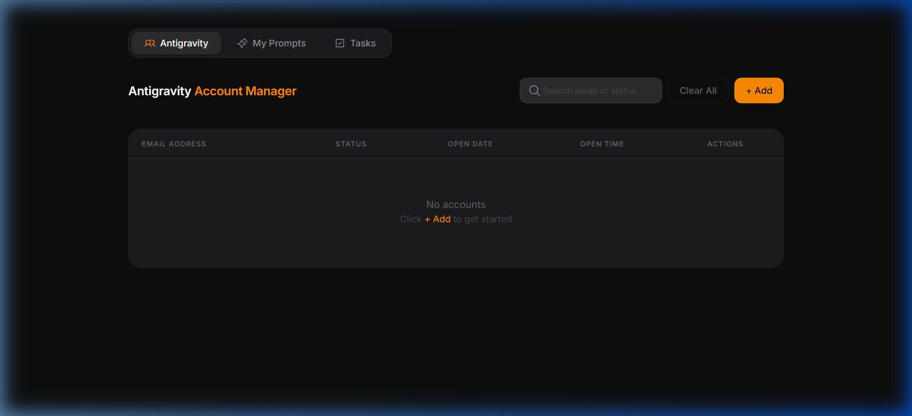

<div align="center">

# 🚀 Antigravity Account Manager

### A sleek, dark-themed productivity dashboard for managing accounts, prompts & daily tasks — all from your browser.

[](https://managecom.netlify.app/)
[](https://managecom.netlify.app/)
[](LICENSE)

</div>

---

## 📸 Screenshots

<div align="center">

### 📋 Accounts Tab


### ✍️ My Prompts Tab


### ✅ Daily Tasks Tab


</div>

---

## ✨ Features

### 📋 Account Management
- **Add & track email accounts** with Open / Closed status
- **Inline status editing** — toggle between Open and Closed directly in the table
- **Date & Time scheduling** — built-in calendar picker and time wheel for scheduling account open dates
- **Real-time search** — instantly filter accounts by email or status
- **Bulk clear** — remove all accounts with one click (with confirmation dialog)

### ✍️ Prompt Library
- **Rich text editor** powered by Quill — supports **bold**, *italic*, <u>underline</u>, links, and embedded images
- **Save & organize** your reusable prompts with optional titles
- **Inline editing** — edit any saved prompt directly with the full Quill editor
- **Copy to clipboard** — one-click copy of prompt content
- **Export to Word (.docx)** — export all prompts into a beautifully formatted Word document with images, links, and styled headings

### ✅ Daily Tasks
- **Create tasks** with a title, priority level (High / Medium / Low), and optional due date
- **Priority indicators** — color-coded dots for instant visual priority recognition
- **Mark as complete** — check off tasks with a single click
- **Filter views** — toggle between All, Active, and Completed tasks
- **Delete tasks** with confirmation dialog

### 🎨 UI / UX
- **Dark mode by default** — sleek, modern interface with frosted glass dropdowns
- **Responsive design** — works seamlessly on desktop, tablet, and mobile
- **Toast notifications** — subtle, non-intrusive feedback for all actions
- **Custom confirmation dialogs** — no ugly browser alerts
- **Smooth transitions & micro-animations** throughout the interface
- **Tabbed navigation** with icon indicators for each section

### 💾 Data Persistence
- **100% client-side** — all data is stored in `localStorage`
- **No backend required** — works fully offline after initial load
- **Zero sign-up** — open the app and start using it immediately

---

## 🛠️ Tech Stack

<div align="center">

| Technology | Purpose |
|:---:|:---:|
|  | Structure & Markup |
|  | Styling & Animations |
|  | Core Logic & Interactivity |
|  | Rich Text Editing (Prompts) |
|  | Client-side .docx Export |
|  | Browser File Downloads |
|  | Icon System |
|  | Typography (Inter) |
|  | Client-side Data Persistence |
|  | Deployment & Hosting |

</div>

---

## 📂 Project Structure

```
Antigravity Account Manager/
│
├── index.html          # Main application shell (tabs, layouts, all component styles)
├── styles.css          # Global design tokens & shared styles
├── app.js              # Core logic — accounts CRUD, calendar, time picker, dropdowns
├── prompts.js          # Prompts module — Quill editor, save, edit, copy, delete
├── tasks.js            # Tasks module — add, complete, filter, delete tasks
├── export.js           # Word export — converts Quill HTML → .docx with images
│
├── header.html         # Header component reference
├── add-panel.html      # Add-account panel component reference
├── table.html          # Accounts table component reference
├── confirm-dialog.html # Confirmation dialog component reference
│
├── screenshots/        # App screenshots for README
│   ├── accounts-tab.png
│   ├── prompts-tab.png
│   └── tasks-tab.png
│
└── README.md           # This file
```

---

## 🚀 Getting Started

### Prerequisites
No build tools, frameworks, or server required — just a modern web browser.

### Run Locally

1. **Clone the repository**
   ```bash
   git clone https://github.com/your-username/antigravity-account-manager.git
   cd antigravity-account-manager
   ```

2. **Open in browser**
   ```bash
   # Simply open index.html in your browser
   # Or use a local server:
   npx serve .
   ```

3. **That's it!** 🎉 No `npm install`, no build step.

### Deploy Your Own

This is a static site — deploy it anywhere:

| Platform | One-Click Deploy |
|----------|:---:|
| **Netlify** | Drag & drop the project folder into [Netlify](https://app.netlify.com/drop) |
| **Vercel** | Import the repo at [Vercel](https://vercel.com/new) |
| **GitHub Pages** | Push to `gh-pages` branch |

---

## 🌐 Live Demo

**👉 [managecom.netlify.app](https://managecom.netlify.app/)**

---

## 📄 License

This project is open source and available under the [MIT License](LICENSE).

---

<div align="center">

**Built with ❤️ by Mutee Ur Rehman**


</div>
